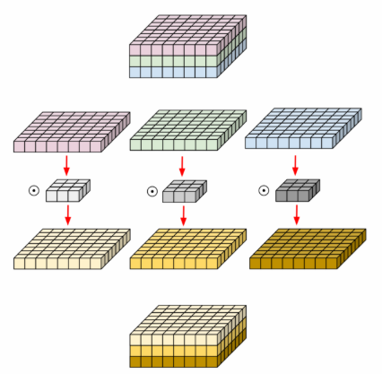
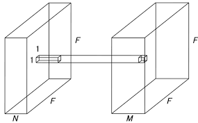
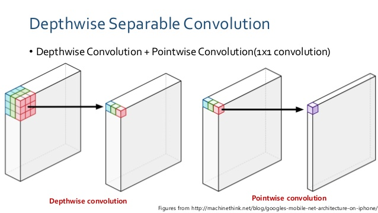

# DepthwiseSeparableConvolution_Pytorch
Implementation of Depthwise Separable Convolution

## Usage

For example usage, please refer to `./example/xecption.py`.

## Explanation on Depthwise Separable Convolution
### 1.Depthwise Convolution



```python
class depthwise_conv(nn.Module): 
  def __init__(self, nin, kernels_per_layer): 
    super(depthwise_separable_conv, self).__init__() 
    self.depthwise = nn.Conv2d(nin, nin * kernels_per_layer, kernel_size=3, padding=1, groups=nin) 
  
  def forward(self, x): 
    out = self.depthwise(x) 
    return out
 ```

### 2.Pointwise Convolution


```python
class pointwise_conv(nn.Module):
  def __init__(self, nin, nout): 
    super(depthwise_separable_conv, self).__init__() 
    self.pointwise = nn.Conv2d(nin, nout, kernel_size=1) 
    
  def forward(self, x): 
    out = self.pointwise(x) 
    return out
 ```
### 3.Depthwise Separable Convoltion


 ```python
class depthwise_separable_conv(nn.Module):
  def __init__(self, nin, kernels_per_layer, nout): 
    super(depthwise_separable_conv, self).__init__() 
    self.depthwise = nn.Conv2d(nin, nin * kernels_per_layer, kernel_size=3, padding=1, groups=nin) 
    self.pointwise = nn.Conv2d(nin * kernels_per_layer, nout, kernel_size=1) 
   
  def forward(self, x): 
    out = self.depthwise(x) 
    out = self.pointwise(out) 
    return out
 ```

## references

1.https://discuss.pytorch.org/t/depthwise-and-separable-convolutions-in-pytorch/7315
2.[hoya012/pytorch-Xception](https://github.com/hoya012/pytorch-Xception)
